# Highly Available Web Application Infrastructure on AWS

# Project Overview

This project demonstrates how to design and deploy a **highly available, scalable, and secure cloud infrastructure** on Amazon Web Services (AWS). It focuses on core AWS services commonly used in real-world cloud engineering and DevOps environments.

The goal of this project is to showcase hands-on experience with AWS compute, security, and scalability concepts rather than just theoretical knowledge.

---

# What This Project Demonstrates

* Understanding of AWS global infrastructure (Regions & Availability Zones)
* Secure access control using IAM and least-privilege principles
* Deployment and management of EC2 instances
* High availability using Auto Scaling Groups
* Traffic distribution using Elastic Load Balancing
* Secure server access using SSH

---

# Architecture Overview

* EC2 instances deployed across multiple Availability Zones
* Auto Scaling Group to maintain desired capacity and replace unhealthy instances
* Elastic Load Balancer to distribute incoming traffic
* IAM roles and policies for secure access control
* SSH access via local terminal and AWS CloudShell

---

# Services Used

* Amazon EC2
* Auto Scaling Group
* Elastic Load Balancing (ELB)
* AWS Identity and Access Management (IAM)
* AWS CloudShell
* Secure Shell (SSH)

---
# Implementation Steps

# IAM Configuration

* Created an IAM users with policy
  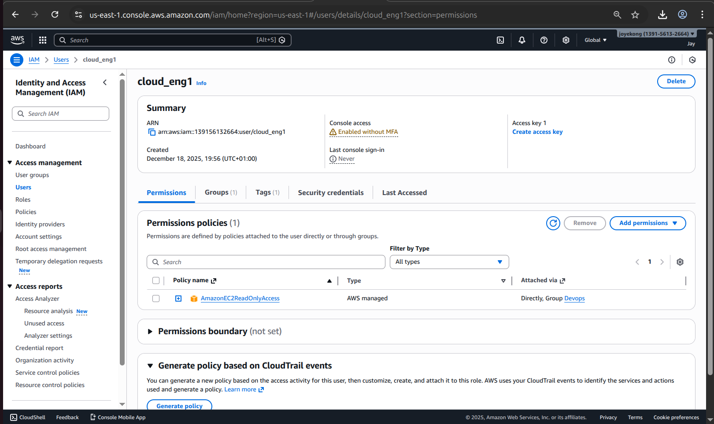

* Created an IAM group with policy
 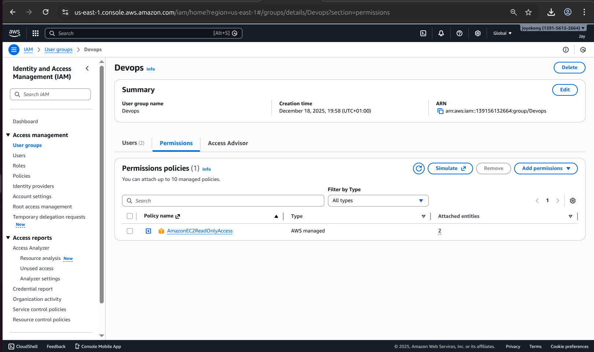

* Assigned least-privilege IAM policies
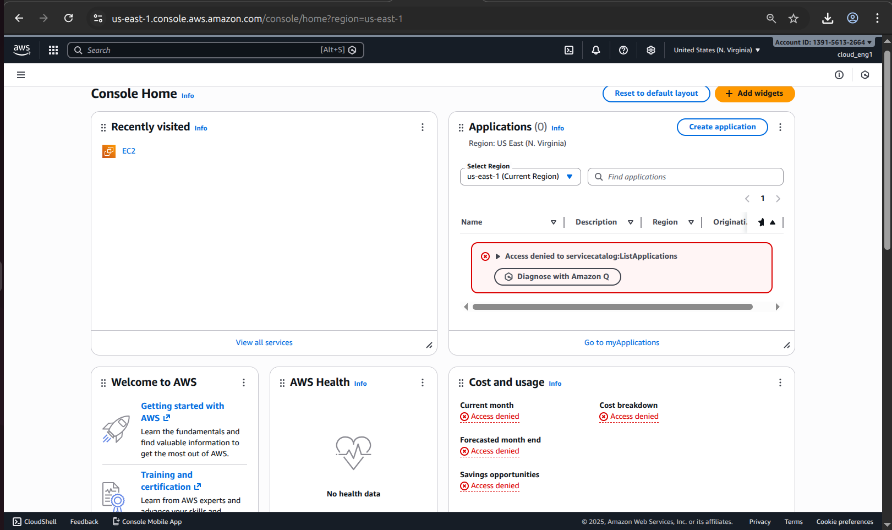

# EC2 Setup

* Created an EC2 launch template
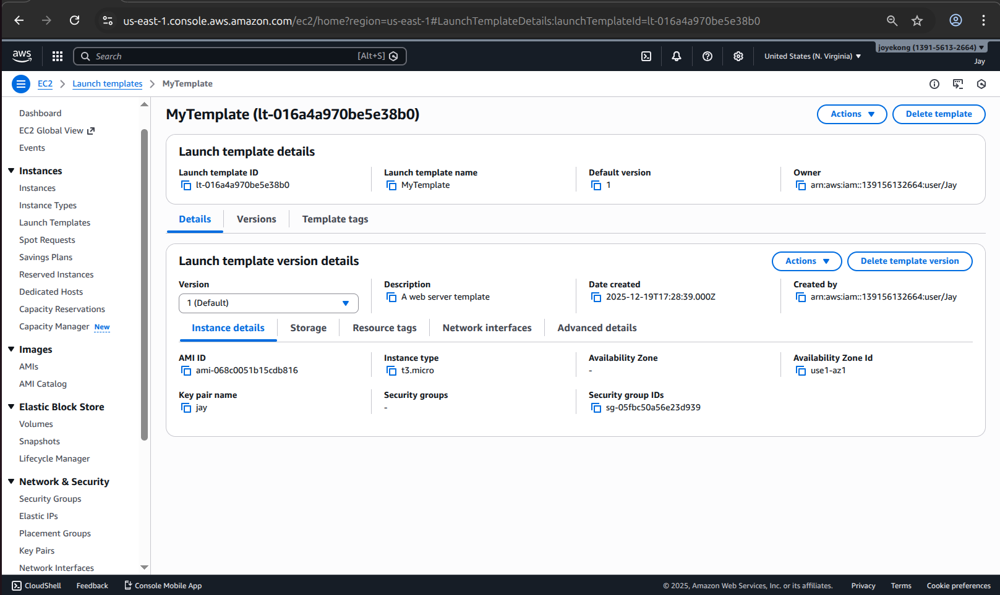

* Launched two EC2 instances using Amazon Linux
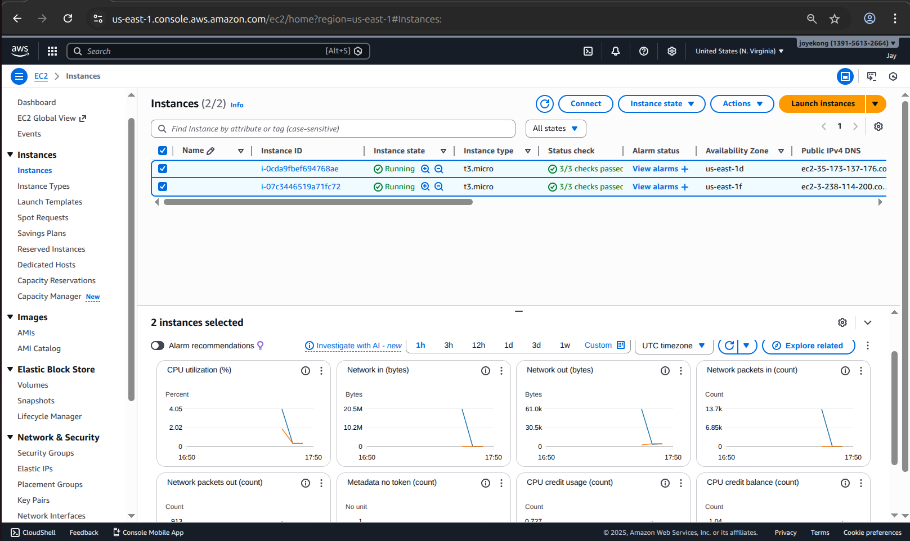

* Configured security groups to allow SSH access
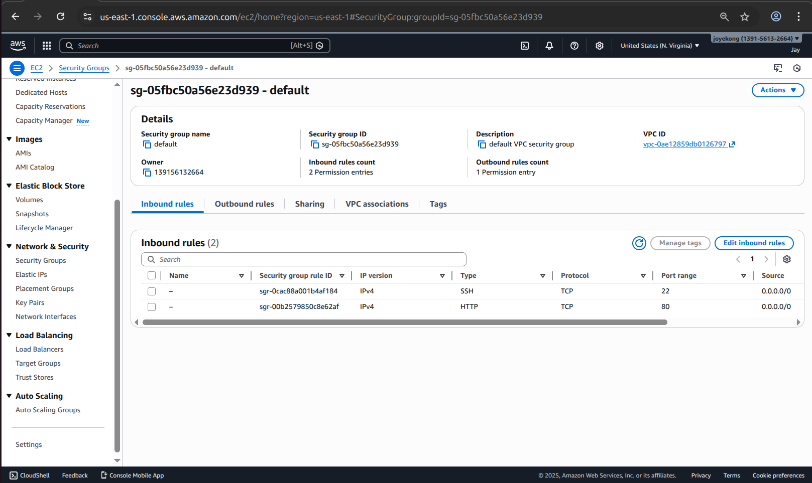

# Auto Scaling Group

* Created an Auto Scaling Group using the launch template
* Defined minimum (2), maximum (4), and desired instance capacity (2)
* Verified automatic instance replacement on failure
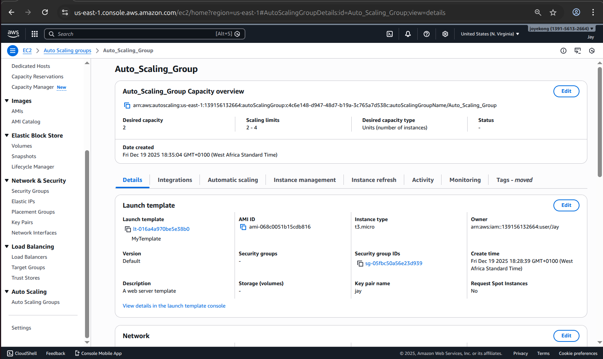

# Elastic Load Balancer

* Created an Application Load Balancer
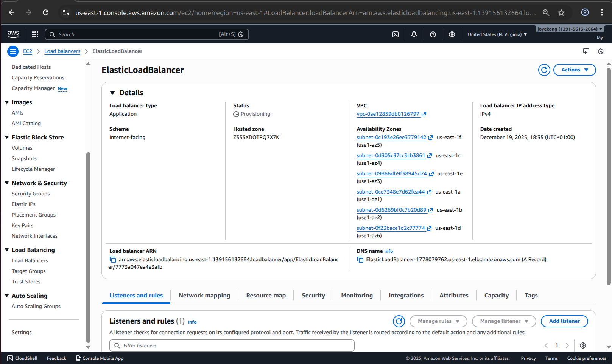

* Attached the Auto Scaling Group as a target
* Verified traffic distribution across EC2 instances
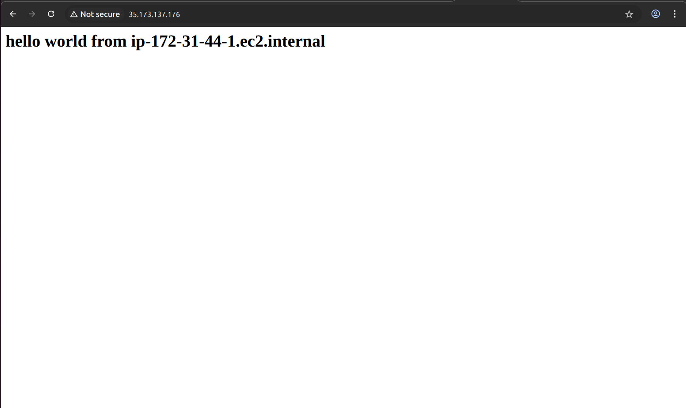
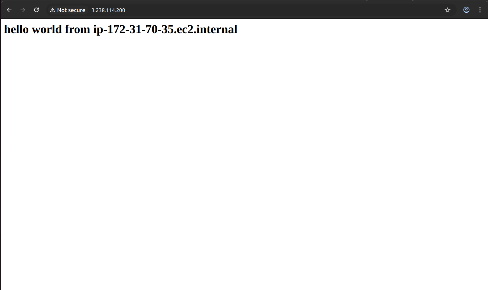

# Secure Server Access
* Connected to EC2 instances using SSH via:

  * Local system terminal
  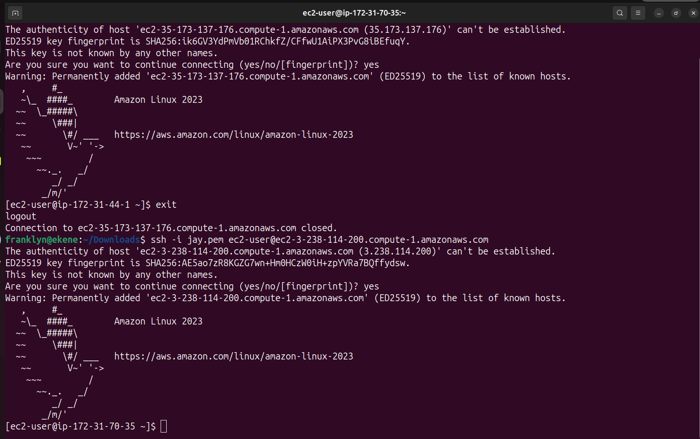
  
  * AWS CloudShell
  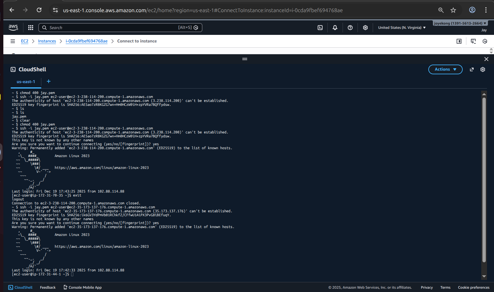
  
# Testing & Validation

* Simulated instance failure and confirmed automatic replacement
* Verified load balancer health checks
* Confirmed secure access control using IAM policies

---

# Outcome

By completing this project, I gained practical experience in:

* Building fault-tolerant cloud infrastructure
* Applying AWS security best practices
* Designing scalable systems
* Managing cloud resources using the AWS Management Console

---

# Author

**Ekene Iyala Franklyn**
Aspiring Cloud Engineer | AWS Fundamentals

---

# Tags

`AWS` `Cloud Engineering` `EC2` `IAM` `Auto Scaling` `Load Balancer` `DevOps`
